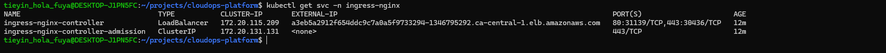

# CloudOps Platform

Production-grade Cloud & DevOps platform built on AWS using Terraform and Kubernetes.

This repository demonstrates real-world infrastructure automation, Kubernetes operations, and scaling behavior — not tutorials.

---

## Architecture Overview

- **Cloud**: AWS
- **IaC**: Terraform (modular VPC + EKS)
- **Kubernetes**: Amazon EKS
- **Autoscaling**: Horizontal Pod Autoscaler (HPA)
- **Observability**: Metrics Server

---

## Kubernetes HPA Autoscaling Proof

This section demonstrates **real, observed Horizontal Pod Autoscaling behavior** on a live Amazon EKS cluster.

### What was implemented

- Deployed a CPU-bound application (`hpa-demo`)
- Configured resource requests & limits
- Installed and patched **Metrics Server**
- Created an **HPA** with:
  - Min replicas: `1`
  - Max replicas: `5`
  - Target CPU utilization: `50%`
- Generated sustained load using a BusyBox load generator
- Observed **scale-up and scale-down in real time**

---

### Scale-Up Evidence

- CPU usage exceeded the 50% target
- HPA increased replicas from **1 → 5**
- New pods were scheduled and became `Running`

📸 Evidence:
- `01-hpa-scale-up.png`
- `02-hpa-metrics.png`

---

### Stabilization Phase

- CPU remained high
- Replica count stabilized at max pods

📸 Evidence:
- `03-hpa-stabilization.png`

---

### Scale-Down Evidence

- Load generator stopped
- CPU usage dropped below threshold
- HPA gradually reduced replicas from **5 → 1**
- Pods were terminated gracefully

📸 Evidence:
- `04-hpa-scale-down-start.png`
- `05-hpa-scale-down-cpu.png`
- `08-hpa-scale-down-live.png`
- `10-hpa-scale-down-complete.png`

---

### Final State

- Cluster returned to minimum replica count
- No pod crashes or errors
- HPA events confirm correct behavior

📸 Evidence:
- `11-hpa-final-event-trail.png`

---

## Why this matters

This implementation demonstrates real Horizontal Pod Autoscaler behavior on a live Amazon EKS cluster.

It validates:
- Correct CPU resource requests and limits
- Proper Metrics Server configuration on EKS
- Autoscaling decisions made dynamically by Kubernetes
- Safe and gradual scale-down without pod disruption

This pattern mirrors how autoscaling is implemented and validated in production Kubernetes environments.

---

## Ingress Controller & External Access Proof

This project uses **NGINX Ingress Controller** deployed on Amazon EKS to expose services externally via an AWS-managed Load Balancer.

### Architecture Overview
- NGINX Ingress Controller running in `ingress-nginx` namespace
- AWS ELB automatically provisioned by Kubernetes Service (LoadBalancer)
- Application traffic routed via Kubernetes Ingress resources

---

### 1. Ingress Resource Creation
Ingress resource successfully created for the application:

---

### 2. AWS Load Balancer Provisioned
The ingress controller automatically created an AWS Elastic Load Balancer:

---

### 3. External Access Validation (curl)
External access validated using the ELB DNS endpoint:

HTTP 200 response confirms successful routing through:
AWS ELB → NGINX Ingress → Kubernetes Service → Pod

---

### 4. Browser Access Confirmation
Application successfully accessed via browser using the ELB DNS:

---

### Outcome
- External traffic securely routed into the EKS cluster
- Ingress controller fully operational
- AWS-managed load balancing confirmed
- Production-ready ingress architecture validated

