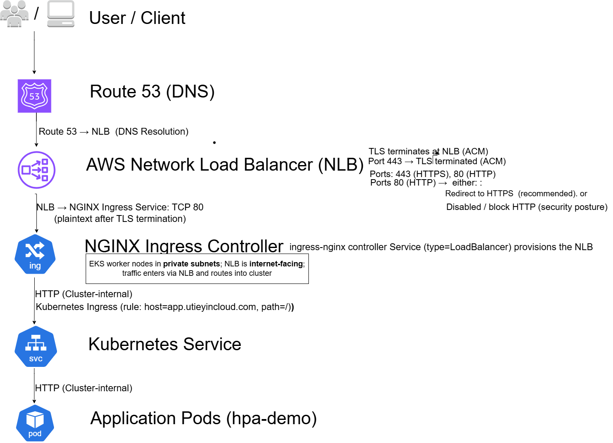

# Architecture

This folder contains the high-level architecture diagrams for the CloudOps Platform.

## Ingress: NGINX on EKS + TLS Termination at AWS NLB (ACM)

This diagram shows how external traffic reaches the `hpa-demo` service through a production-style ingress path:

- User/Client resolves `app.utieyincloud.com` via Route 53
- Traffic hits an **internet-facing AWS NLB**
- **TLS terminates at the NLB** using an **ACM certificate**
- NLB forwards decrypted traffic to the **NGINX Ingress Controller** (running in EKS)
- NGINX routes to the internal Kubernetes **Service**
- Service forwards to the application **Pods**

### Diagram

### Why this matters
This setup demonstrates:
- Clean separation of concerns (TLS at edge, routing in-cluster)
- AWS-native certificate management (ACM)
- Kubernetes-native routing (Ingress rules + Services)
- A security posture decision for HTTP: disable or redirect to HTTPS
