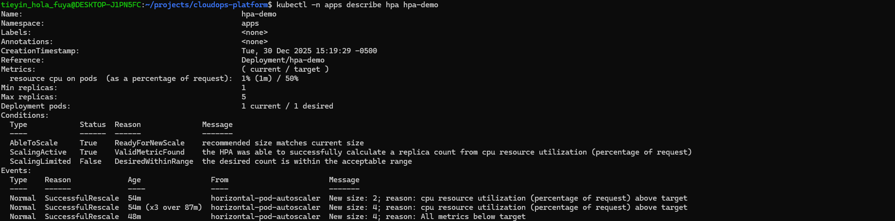
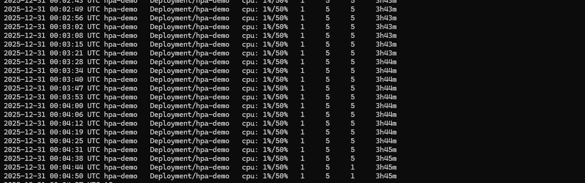

# HPA Validation – Production Evidence

This document validates Horizontal Pod Autoscaling behavior on the CloudOps EKS platform using CPU-based scaling.

## Preconditions
- Metrics Server installed and available
- HTTPS ingress functional via NLB
- HPA configured with:
  - Min replicas: 1
  - Max replicas: 5
  - Target CPU: 50%

## Validation Steps

### 1. HPA Configuration

### 2. Scale-Up Trigger
CPU load injected into the application pod.

### 3. Scale-Down Initiation
Load removed; CPU utilization drops.

### 4. Scale-Down Completion
Replicas return to minimum.

### 5. Metrics Server Proof
Metrics API available and serving data.

## Observations
- HPA scaled from 1 → 5 replicas under load
- Scale-up occurred within ~60–90s
- Scale-down completed after stabilization window
- No manual intervention required

## Conclusion
This confirms production-grade autoscaling behavior aligned with CloudOps best practices.

