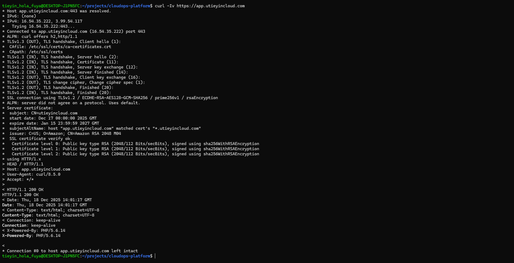
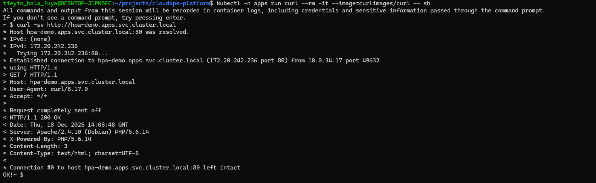

# Ingress (NGINX) + TLS Termination on AWS NLB (ACM)

Expose a Kubernetes Service via **NGINX Ingress** while terminating **TLS at an AWS Network Load Balancer (NLB)** using an **ACM certificate**.

This module publishes the `apps/hpa-demo` service and supports:
- **External HTTP** access (port **80**)
- **External HTTPS** access (port **443**) with **TLS termination at the NLB (ACM)**
- **In-cluster routing** from NGINX → Service over HTTP (port **80**)

---

## Cost control checklist

Before you finish the session, confirm the items below to avoid surprise charges:
- [ ] Delete the **Ingress** (`kubectl delete -f ...`)
- [ ] Uninstall **ingress-nginx** (`helm uninstall ...`)
- [ ] Confirm the **LoadBalancer Service** is gone (NLB deletion follows)
- [ ] If you’re done with the environment: scale down / delete EKS node group (or cluster) per your project plan

> NLB + EKS are the typical cost drivers. Don’t leave them running unintentionally.

---

## Architecture

Traffic flow:

- Client → Route 53 (`app.utieyincloud.com`) → **AWS NLB** (TLS 443 / TCP 80)
- TLS terminates at the **NLB** (ACM certificate)
- NLB forwards traffic to the **ingress-nginx controller Service**
- NGINX routes to `hpa-demo` Service in the `apps` namespace

### Evidence (screenshots)

**1) External HTTPS (TLS terminates at NLB / ACM)**  


**2) External HTTP**  


**3) In-cluster routing**  


---

## Repository files

- `k8s/ingress/ingress-nginx-values.yaml` — Helm values for ingress-nginx (NLB + ACM TLS termination config)
- `k8s/ingress/hpa-demo-ingress.yaml` — Ingress resource for `app.utieyincloud.com`

---

## Deploy

### 1) Install ingress-nginx with Helm
```bash
helm repo add ingress-nginx https://kubernetes.github.io/ingress-nginx
helm repo update

helm upgrade --install ingress-nginx ingress-nginx/ingress-nginx \
  -n ingress-nginx --create-namespace \
  -f k8s/ingress/ingress-nginx-values.yaml

### 2) Apply the application Ingress
```bash
kubectl apply -f k8s/ingress/hpa-demo-ingress.yaml

### 3) Verify
Confirm the ingress-nginx Service received an AWS NLB:
```bash
kubectl -n ingress-nginx get svc ingress-nginx-controller -o wide

Confirm the Ingress resource:
```bash
kubectl -n apps get ingress hpa-demo -o wide
kubectl -n apps describe ingress hpa-demo

External connectivity checks:
```bash
curl -I http://app.utieyincloud.com
curl -vk https://app.utieyincloud.com

Expected:

-HTTP responds successfully
-HTTPS completes a valid TLS handshake using the ACM certificate

## Design notes (why this approach)

- TLS is terminated at the AWS NLB, not inside Kubernetes → No TLS private keys or cert secrets stored in the cluster.
- Internal traffic remains HTTP → Standard practice inside a trusted VPC boundary.
- NGINX handles routing, AWS handles transport security → Clear separation of responsibilities and simpler operations.

This mirrors common production patterns used in managed Kubernetes platforms.

## Cleanup (avoid ongoing cost)

### 1) Delete the application Ingress
```bash
kubectl delete -f k8s/ingress/hpa-demo-ingress.yaml

### 2) Uninstall ingress-nginx (removes the LoadBalancer Service)
```bash
helm uninstall ingress-nginx -n ingress-nginx

### 3) Confirm no LoadBalancer Services remain
```bash
kubectl get svc -A | grep LoadBalancer || echo "No LoadBalancer services found"

### 4) Optional: delete namespace
```bash
kubectl delete ns ingress-nginx

### 5) Full environment teardown (if done with EKS)
```bash
-Delete EKS node group(s)
-Delete EKS cluster

## Failure scenarios

- **NGINX pod failure**
  - Kubernetes restarts the pod
  - NLB continues forwarding traffic to healthy targets

- **Ingress controller failure**
  - Service remains, but traffic drops until controller recovers
  - Demonstrates need for multiple replicas (future improvement)

- **ACM certificate issue**
  - TLS handshake fails at NLB
  - No impact to in-cluster traffic

## Rebuild / Demo

This module can be recreated end-to-end:

1. Provision EKS and networking using Terraform
2. Install ingress-nginx via Helm
3. Apply ingress manifest
4. Validate:
   - HTTPS via ACM + NLB
   - HTTP fallback
   - In-cluster routing

Designed for live demos.

